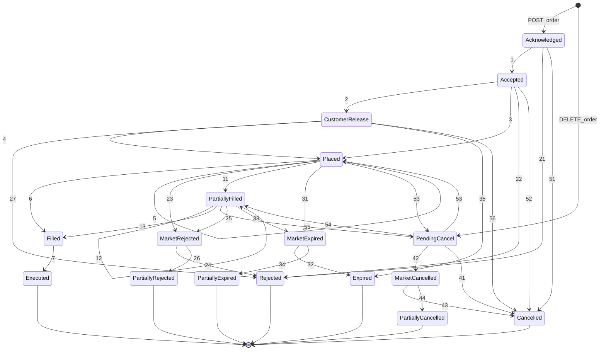

```mermaid
stateDiagram-v2
    [*] --> Acknowledged: POST_order
    [*] --> PendingCancel: DELETE_order
    
    Acknowledged --> Accepted: 1
    Acknowledged --> Rejected: 21
    Acknowledged --> Cancelled: 51

    Accepted --> CustomerRelease: 2
    Accepted --> Placed: 3
    Accepted --> Rejected: 22
    Accepted --> Cancelled: 52

    CustomerRelease --> Placed: 4
    CustomerRelease --> Rejected: 27
    CustomerRelease --> Expired: 35
    CustomerRelease --> Cancelled: 56

    Placed --> Filled: 6
    Placed --> Placed: 5
    Placed --> MarketRejected: 23
    Placed --> PartiallyFilled: 11
    Placed --> MarketExpired: 31
    Placed --> PendingCancel: 53

    Filled --> Executed: 7

    PartiallyFilled --> PartiallyFilled: 12
    PartiallyFilled --> Filled: 13
    PartiallyFilled --> PendingCancel: 55
    PartiallyFilled --> MarketRejected: 25
    PartiallyFilled --> MarketExpired: 33

    MarketRejected --> Rejected: 24
    MarketRejected --> PartiallyRejected: 26
    
    MarketCancelled --> Cancelled: 43
    MarketCancelled --> PartiallyCancelled: 44    

    MarketExpired --> Expired: 32
    MarketExpired --> PartiallyExpired: 34
    
    PendingCancel --> MarketCancelled: 42
    PendingCancel --> Cancelled: 41
    PendingCancel --> Placed: 53
    PendingCancel --> PartiallyFilled: 54

    Executed --> [*]
    PartiallyExpired --> [*]
    Rejected --> [*]
    PartiallyRejected --> [*]
    Cancelled --> [*]
    PartiallyCancelled --> [*]
    Expired --> [*]
```