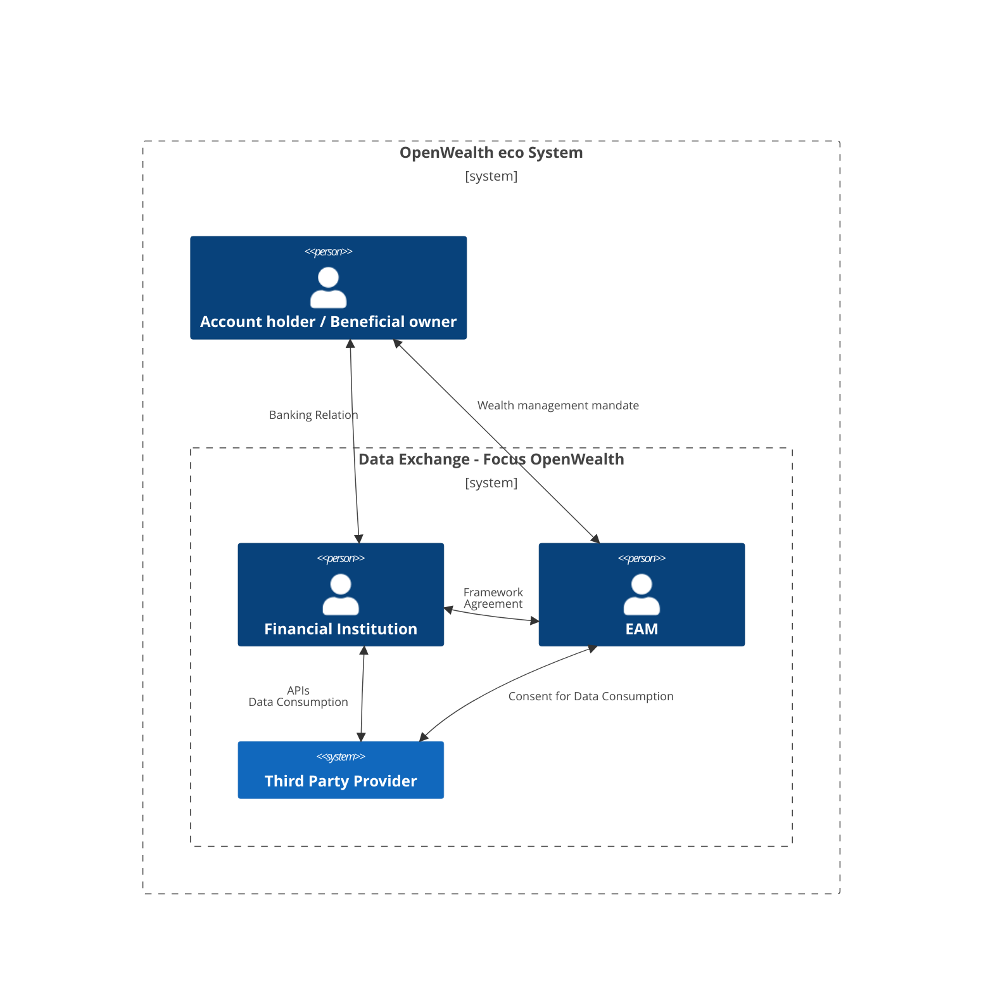
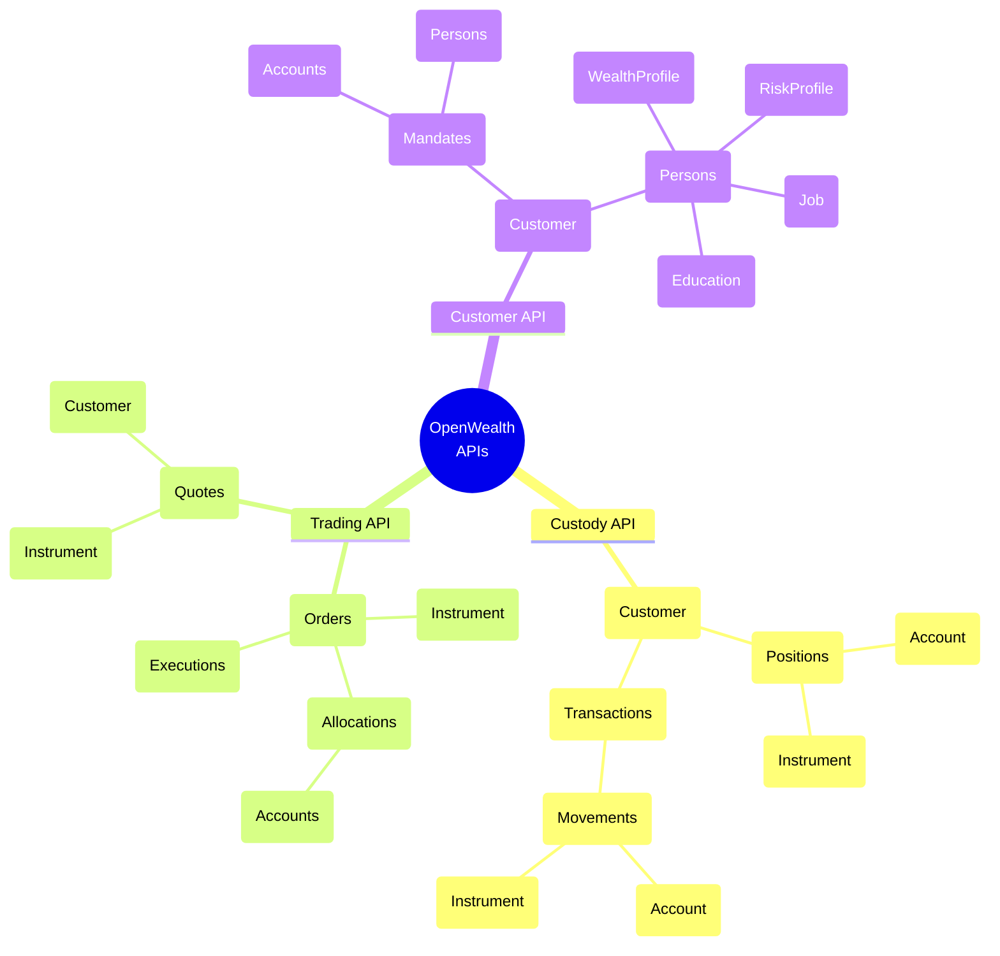

## Introduction

The OpenWealth Association’s mission is to connect financial institutions, WealthTechs and other service providers to develop, maintain and distribute the Open API standard for a global wealth management community. Furthermore, the association aims to foster the exchange of expertise among its members and with third parties, as well as to cooperate with organizations of a similar nature.

Table of content:
* [OpenWealth eco system](#openwealth-eco-system)
* [OpenWealth universe](#openwealth-universe)
* [OpenWealth APIs](#openwealth-apis)
* [Documentation](#documentation)
* [Repository structure](#repository-structure)
* [Contribute](#contribute)

## OpenWealth eco system

In the triangular relationship between custodian bank (custodian), the account holder and/or beneficial owner (the BO) and a third party financial service provider (the TPP) OpenWealth APIs define the <b>data contract</b> between the custodian and TPP - the technical terms by which a service provider is enabled and allowed to exchange data with the cutsodian: Think of a guide on how to build a <b>standardized plug</b> for digital interactions with between custodian banks and service providers.



The <b>custodian</b> is typically a bank that provides
* Account managment und payment services
* Safekeeping, execution services and access to trading markets
* Over-The-Counter (OTC) contracts and lending services
* Etc

The <b>TPP</b> may be
* an external asset manager (EAM) who is providing wealth managment services such as wealth advisory advisory or managment to the BO
* a service plattform providing applicatory services such as portfolio managament systems, wealth data aggregation, analysis & reporting etc.
* a party providing execution and payment services on behalf of the BO or as part of the wealth managment mandate

The OpenWealth Association provides
* Definition, maintenance and publication of the API specifications (the actual data contracts) for the scope of the OpenWealth universe
* Documentation of the specification and guides and best practices for implementors - API providers and consumers
* Sample data for a large set of use-cases
* A sandbox environment for implemeentors to test and develop against
* Q&As and support services for implementors and interested parties

The OpenWealth Association <b>does not</b> provide
* Infrastructure for hosting APIs
* Software/Frameworks for the integration and implementation with software of choice

## OpenWealth universe
### Data objects, relations and context of APIs

The 3 APIs in scope - customer, custody and trading - serve and specify their isolated use-cases. The APIs can be implemented independent of one-another - providing a custody API does not imply the necessity of implementing the cutomer API etc.. However the APIs and the contained business object (data entities) have partly common, and API overarching significance. It is therefore of great benefit to provide consistency in terms of entity identification and core system data transformation in order to reduce confusion and implementation errors for the API consuming parties. The following graphic illustrates the main entities in scope:




## OpenWealth APIs

Open Wealth defines, maintains and publishes 3 APIs:

- [Custody API](custodyAPI.yaml) - enabling customer life cycle managment, such as onboarding a new client, providing KYC information to the bank etc.
- [Customer API](customerAPI.yaml) - receiving securities accounting including post-trade transaction data and position valuation
- [Trading API](tradingAPI.yaml) - managing order placement and related processes for authorized accounts

## Documentation

A detailed introduction into OpenWealth APIs and detailed documentation to each API including guidelines, good practices, entitiy models and examples ar found in the wiki:

[OpenWealth Wiki](https://github.com/OpenWealth/OpenWealth/wiki)

## Repository structure

All the API specification source files are contained in the `src` folder with a cantianed folder for each API and folder `generics` containing files shared among all APIs.
An API folder contains the root `API.yaml` which references files in folders structured by the redocly convention:

```md
{name}
├── API.yaml
├── paths
├── components
│   ├── headers
│   ├── parameters
│   ├── schemas
│   ├── examples
```

The budled and published API file is created and validated by `redocly cli` and committed to the root folder. Each Pull-Request to main branch with appropriate tag (api name - custody, customer, trading) will automatically trigger the bundling process. Details to the bundling and linting are found in the wiki (see link above)

## Contribution

We welcome contributions to this repository and encourage collaboration to improve the YAML specification. All changes must adhere to the established schema structure and naming conventions. Before submitting a pull request, please open an issue to discuss your proposal. Contributions should be atomic, well-documented, and include relevant test cases or validation examples. The maintainers reserve the right to review, modify, or reject submissions that do not align with the project's goals or quality standards. For detailed guidelines, refer to the [Contribution](https://github.com/OpenWealth/OpenWealth/wiki/contribution) documentation.
