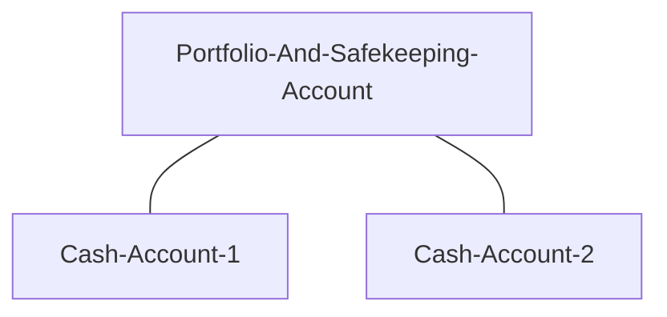
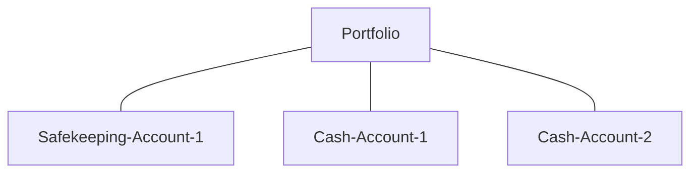
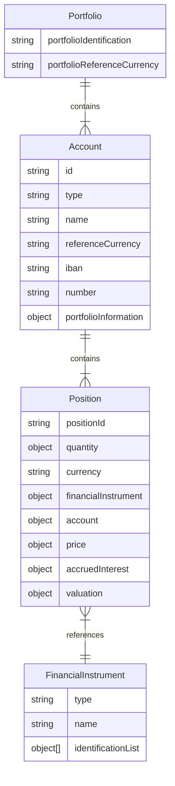
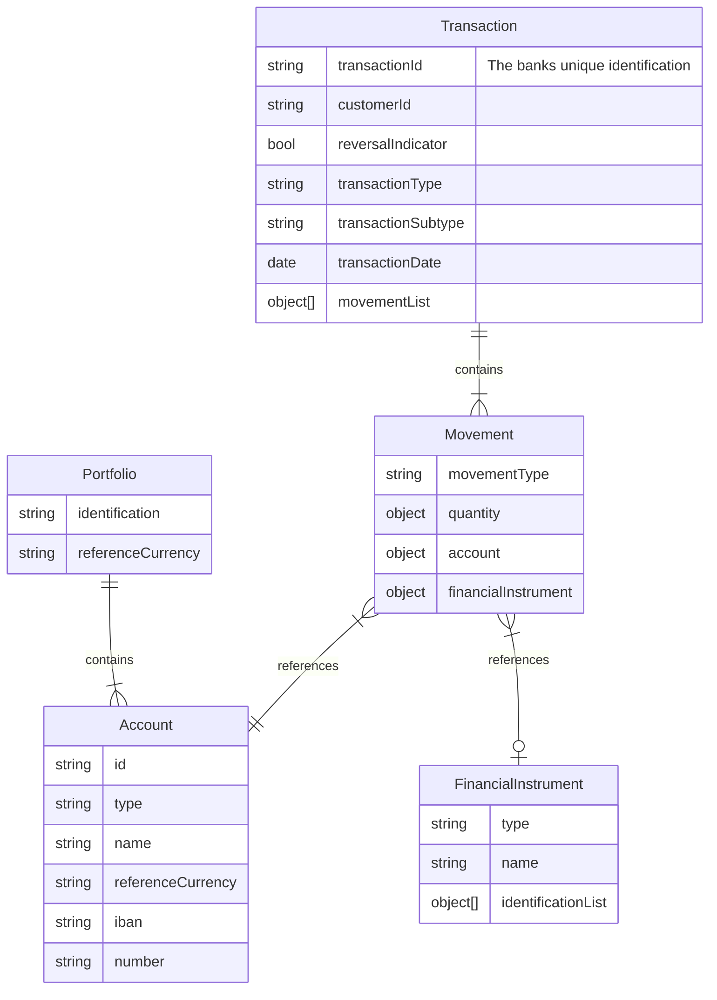
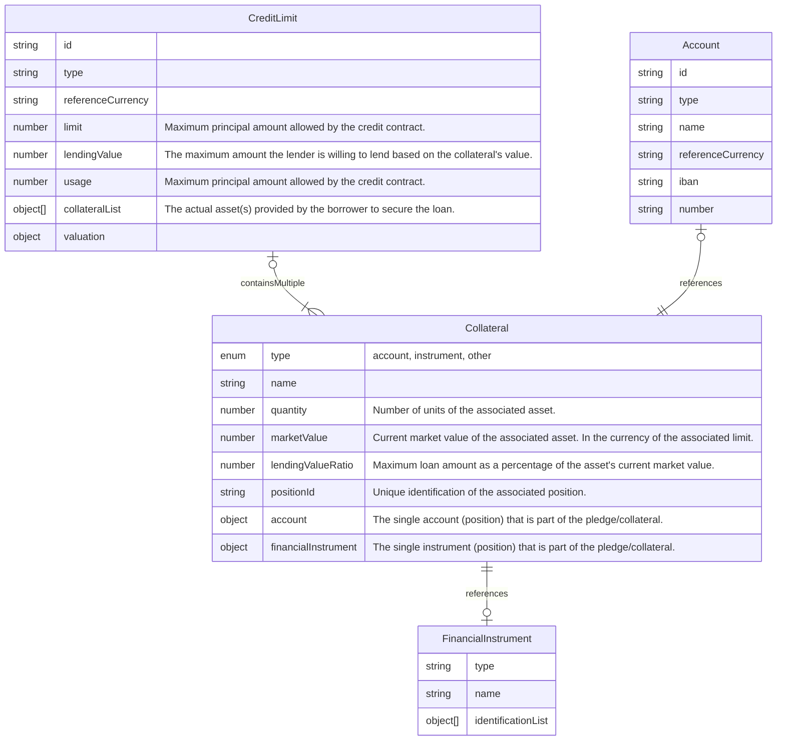

# Business objects and data entities

In the following we will describe the essential data objects, their relations and their interface represenation. We will highlight conventions an try to enhance a common understanding of these objects.

- [Customer](#customer)
- [Portfolio](#portfolio)
- [Account](#account)
- [Financial Instruments](#financial-Instrument)
- [Position](#position)
- [Transaction](#transaction)
- [Movement](#movement)

## Customer

The customer entity describes the business (contractual) partner of the custodian bank. This can be a natural person, a legal person or a person association. In the case of legal persons the customer is usually the account holder and beneficial owner of the associated accounts. The customer must be uniquly identified with an id used in the api.

## Portfolio

A portfolio is an entity that contains a collection of accounts. The portfolio belongs to a customer.

> ***Note:***
Custodian banks have a heterogeneous understanding of the entity portfolio. For some it is equivalent to a safekeeping account (as described in the next section) and for others the portfolio is a container for for a set of accounts, both safe keeping and cash accounts. In the context of OpenWealth a Portfolio is not a mandatory information. It is treated as additional data for grouping and reporting purposes

Examples of account relations:

Example1

Example 2

## Account

An account is an entity that describes a basket/container of financial instruments. Each account must be associated to a customer (typically the account holder and beneficial owner) and is usually enclosed in a portfolio. There mainly two types of accounts:

- Cash Account
- Safekeeping Account

An account must by identified by a unique reference, the account number. Most cash accounts (and some safekeeping accounts) should also have an [IBAN](https://en.wikipedia.org/wiki/International_Bank_Account_Number) - International Bank Account Number - associated to it.

The cash account is as commonly understood a container for holdings of a currency. In this case the currency can be looked at as the financial instrument identified by its ISO3 currency code. In the case of a cash account the ladder holds only one financial instrument.
The safekeeping account is commonly used es a container for exchange traded instruments. The financial instrument is typically identified by an [ISIN](https://en.wikipedia.org/wiki/International_Securities_Identification_Number) - International Securities Identification Number. However there are many more instrument types that need to be considered, such as OTC products, like FX Forwards, currency & interest swaps, cryptocurrencies etc.

## Financial Instrument

A financial instrument is an entity that desribes a monetary contract, which confers a right or claim against some counterparty in the form of a payment, equity ownership or dividends (stocks), debt (bonds, loans, deposit accounts), currency (forex), or derivatives (futures, forwards, options, and swaps). Financial instruments can be segmented by asset class, and as cash-based, securities, or derivatives.
An exchange traded financial instrument is typically identified by an [ISIN](https://en.wikipedia.org/wiki/International_Securities_Identification_Number) - International Securities Identification Number. Many other instrument types such as OTC products, like FX Forwards, currency & interest swaps, cryptocurrencies etc. have proprietary ways of identification.
In the context of OpenWealth the identification of the financial instrument is mandatory. In addition all properties (such as contract size, price factor, denomination, derivative figures etc.) required for a correct valuation of the instrument should be added to the properties. There are many classification schemes available for the classification of an instrument. OpenWealth proposes to use ISO 10962 as the standard classification of an instrument

## Position

A position is an entity that describes a certain amount or units of a financial instrument in a given account. It includes the information needed for the valuation at a given date/time, such as price, price type, price currency etc. The identification of a position will depend on the software used for the core banking ledger or the securities accounting. Some regard every acquired lot as a unique position and others may identify a position by its account, instrument identification, exchange and currency.
OpenWealth requires a unique identification of the position. However it is up to the custodian bank to implement its own conventions

**Entity Relationships of a position**

## Transaction

A transaction is an entity that describes an agreement of trade of financial wealth or a business event caused by the held instrument that may result in change of holding or risk. Properties are the transaction type, dates related to the agreement, related account and customer, etc. Examples of transactions simple transfer of cash, a purchase of exchange-traded security, a confirmation of revenue or right distribution of a holding, a forward foreign exchange transaction, etc. A transaction encloses one or more movements of financial instruments in a given account.

**Entity Relationships of a transaction**

## Movement

A movement is an entity that describes a change in units of a particular financial instrument in a given account. Typically a prize is associated with the movement, for example, the purchase price of a security. A transaction encloses one or more movements of one or more financial instruments. A purchase of a stock for example can consist of the purches units of the particular stock and a number of movements on the associated cash account, such as gross amount (units * price), brokerage fee, stamp and/or other local taxes.

## Credit Limit

TBD

**Entity Relationships of a credit limt**

