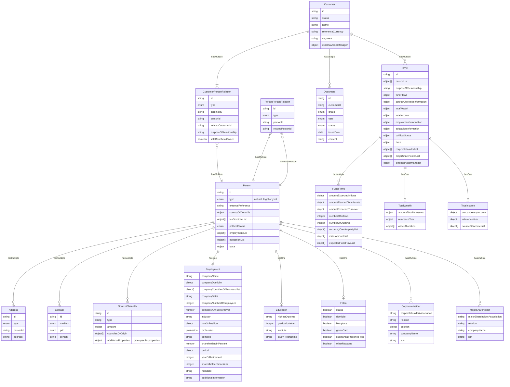

# Business objects and data entities

In the following we will describe the essential data objects, their relations and their interface represenation. We will highlight conventions an try to enhance a common understanding of these objects.

- [Customer](#customer)
- [Person](#person)
- [Customer Relation](#customer-relation)
- [Person Relation](#person-relation)
- [KYC](#kyc)

## Customer

Customer entity describes the business parter (Vertragspartner) of the bank. The customer has persons (legal and natural) with certain roles associated to him.

## Person

## Customer Relation

TBD

## Person Relation

TBD

## KYC

**Entity Relationships of a position**

