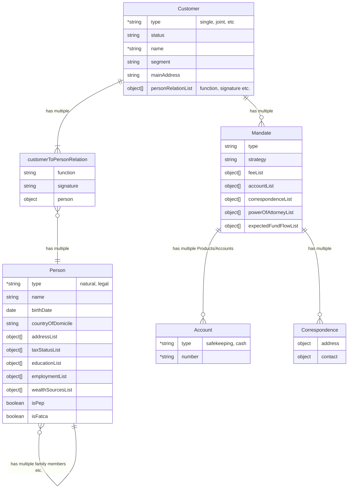
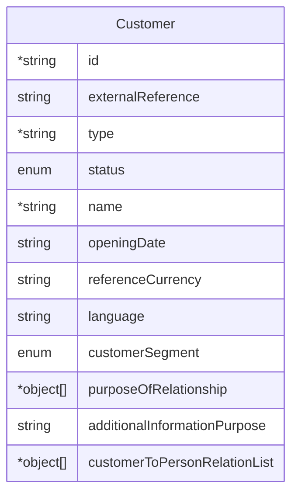
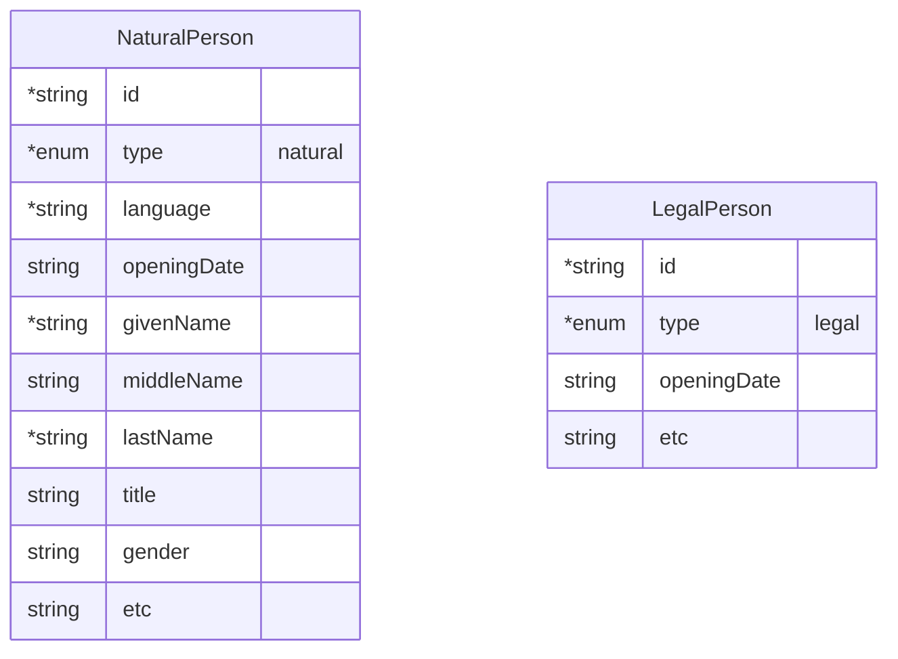
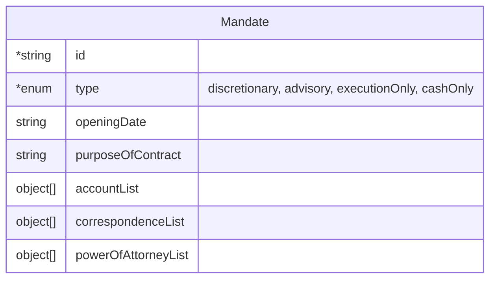
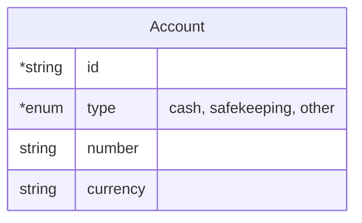

In the following the essential data objects, their relations and their interface representation are described. The conventions are highlighted and the common understanding of these objects are outlined.

- [Customer](#customer)
- [Person](#person)
- [Mandate](#mandate)
- [Account](#account)
- TBD

## Highlevel entities

## Customer

A customer is the person or entity that enters into a contractual agreement with the custodian and in our case the external asset manager. It serves as the legal and operational anchor under which one or more mandates are managed.
Under Swiss law, the customer may be:
- A single natural or legal person, or
- Multiple persons acting jointly, such as:
  - Joint account holders
  - Simple partnerships (einfache Gesellschaft) formed for shared asset ownership
  - Other multi‑party arrangements with collective rights and obligations

## Person

A person is any entity that the law recognizes as having rights and obligations.
This includes:
- Natural persons — human beings with inherent legal capacity from birth.
- Legal persons — organizations or entities (such as corporations, associations, or foundations) that are granted legal personality by law, enabling them to act, own property, enter contracts, and be held liable.

## Mandate

A mandate is a contractual agreement under Swiss law in which a customer (the principal) instructs an asset/wealth manager (the agent) to manage their assets with care and in the customer’s best interest.
It is governed primarily by the rules on Auftrag (Art. 394 ff. OR).

## Account

An account is a defined contractual relationship with a custodian bank used to record, hold, and administer a client’s assets or cash.
It serves as the operational container through which safekeeping, transactions, and reporting are executed.

**Key characteristics**
- Identifies and segregates the client’s assets (cash, securities, other financial instruments).
- Exists in various forms (e.g., cash account, securities/safekeeping account, FX account) depending on the asset type.
- Opened and maintained by the custodian in the name of the client (single or joint).
- Forms the operational basis for executing the external asset manager’s mandate.

