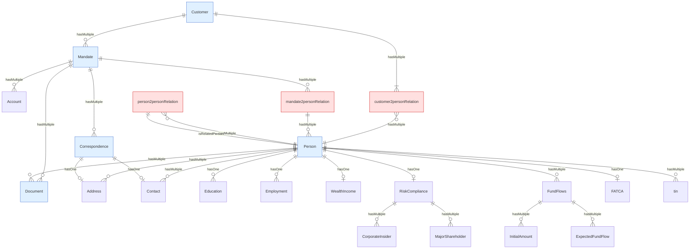
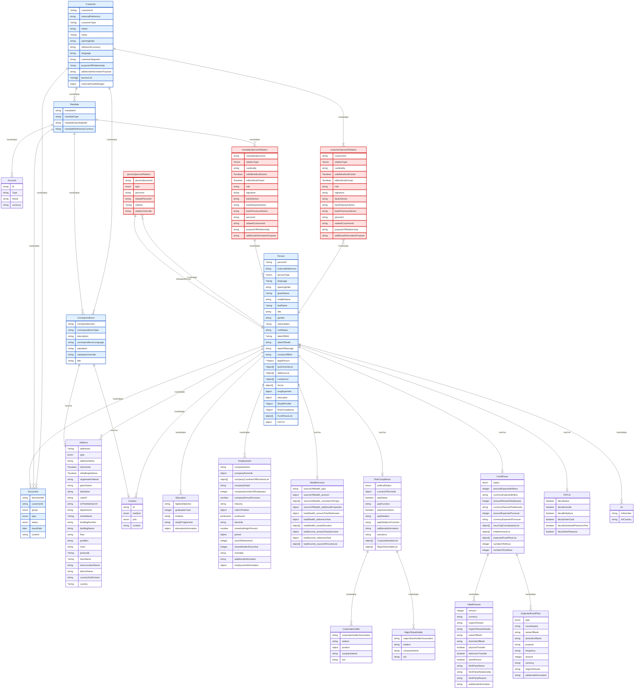

```mermaid
erDiagram

%% Main Business Objects -------------------------------

    Customer {
    }

    Mandate {
    }

    Person {
    }

    Account {
    }

    Correspondence {
    }

    Document {
    }

%% Slave Business Objects -------------------------------

    Address {
    }

    Contact {
    }

    Education {
    }

    Employment {
    }

    WealthIncome {
    }

    FundFlows {
    }

    CorporateInsider {
    }

    MajorShareholder {
    }

    RiskCompliance {
    }

    FATCA {
    }

    tin {
    }

    InitialAmount {         
    }

    ExpectedFundFlow {           
    }

%% Relation-Definition-Objects -------------------------------

    customer2personRelation {
    }

    person2personRelation {
    }

    mandate2personRelation {
    }

%% Beziehungen

    Customer ||--|{ customer2personRelation : hasMultiple
    Customer ||--o{ Mandate : hasMultiple

    Mandate ||--o{ mandate2personRelation : hasMultiple
    Mandate ||--o{ Account : hasMultiple
    Mandate ||--o{ Document : hasMultiple  
    Mandate ||--o{ Correspondence : hasMultiple  

    Person ||--o{ Address : hasMultiple
    Person ||--o{ Contact : hasMultiple
    Person ||--o{ tin : hasMultiple
    Person ||--o{ Employment : hasOne
    Person ||--o{ Education : hasOne
    Person ||--o| WealthIncome : hasOne
    Person ||--o| RiskCompliance : hasOne
    Person ||--o{ FundFlows : hasMultiple
    Person ||--o| FATCA : hasOne
    Person ||--o{ Document : hasMultiple
  
    RiskCompliance ||--o{ CorporateInsider : hasMultiple
    RiskCompliance ||--o{ MajorShareholder : hasMultiple

    FundFlows  ||--o{ InitialAmount : hasMultiple
    FundFlows  ||--o{ ExpectedFundFlow : hasMultiple

    Correspondence ||--o| Address : hasOne
    Correspondence ||--o| Contact : hasOne
    
    customer2personRelation }o--|| Person : hasMultiple
    mandate2personRelation ||--o{ Person : hasMultiple 
    person2personRelation }o--|| Person : hasMultiple
    person2personRelation ||--|| Person : isRelatedPerson

%% Colors

    style Customer, Mandate, Person, Document, Correspondence fill:#e0f0ff,stroke:#3366cc,stroke-width:1px
    style customer2personRelation, mandate2personRelation, person2personRelation fill:#ffe0e0,stroke:#cc0000,stroke-width:1px
```

```mermaid

```


```mermaid
erDiagram

%% Parent Business Objects --------------------------------

    Customer {
        *string customerId
        string externalReference
        *string customerType
        string status
        *string name
        string openingDate
        string referenceCurrency
        string language
        string customerSegment
        *array purposeOfRelationship
        string additionalInformationPurpose
        *string[] personList
        object externalAssetManager
    }

    Mandate {
        string mandateId
        string mandateType
        string mandateOpeningDate
        string mandateReferenceCurrency
    }

    Person {
        *string personId
        string externalReference
        *enum personType
        *string language
        string openingDate
        *string givenName
        string middleName
        *string lastName
        string title
        string gender
        *array nationalities
        string civilStatus
        *string dateOfBirth
        string dateOfDeath
        string dateOfMarriage
        string countryOfBirth
        **object legalPerson
        *object[] taxDomicileList
        *object[] addressList
        *object[] contactList
        object[] tinList
        object employement
        object education
        *object WealthProfile
        *object RiskCompliance
        object[] FundFlowsList
        object FATCA
    }

    Account {
        string Id
        string Type
        string Name
        string currency
    }

    Correspondence {
        string correpondenceId
        string correspondenceType
        string description
        string correspondenceLanguage
        string salutation
        string salutationOverride
        string title
    }

    Document {
        string documentId
        string customerId
        enum group
        enum type
        enum status
        date issueDate
        string content
    }

%% Child Business Objects -------------------------------

    Address {
        *string addressId
        enum type
        string addressName
        *boolean isDomicile
        *boolean isMailingAddress
        string organisationName
        string givenName
        string lastName
        string careOf
        string toTheAttentionOf
        string department
        *string streetName
        string buildingNumber
        string buildingName
        string floor
        string postBox
        string room
        *string postcode
        *string townName
        string townLocationName
        string districtName
        string countrySubDivision
        *string country
    }

    Contact {
        string id
        enum medium
        enum prio
        string content
    }

    Education {
        string highestDiploma
        integer graduationYear
        string institute
        string studyProgramme
        object educationInformation
    }

    Employment {
        string companyName
        object companyDomicile
        object[] companyCountriesOfBusinessList
        string companyDetail
        integer companyNumberOfEmployees
        number companyAnnualTurnover
        string industry
        object roleOrPosition
        profession profession
        string domicile
        number shareholdingInPercent
        object period
        integer yearOfRetirement
        integer sharedholderSinceYear
        string mandate
        string additionalInformation
        object employmentInformation
    }

    WealthIncome {
        string sourceOfWealth_type
        object sourceOfWealth_amount
        object[] sourceOfWealth_countriesOfOrigin
        object sourceOfWealth_additionalProperties
        object totalWealth_amountTotalNetAssets
        object totalWealth_referenceYear
        object[] totalWealth_assetAllocation
        object totalIncome_amountYearlyIncome
        object totalIncome_referenceYear
        object[] totalIncome_sourceOfIncomeList
    }

    FundFlows {
        enum status
        integer amountExpectedInflows
        string currencyExpectedInflow
        integer amountPlannedTotalAssets
        string currencyPlannedTotalAssets
        integer amountExpectedTurnover
        string currencyExpectedTurnover 
        object[] recurringCounterpartyList
        object[] initialAmountList
        object[] expectedFundFlowList
        integer numberOfInflows
        integer numberOfOutflows
    }

    CorporateInsider {
        string corporateInsiderAssociation
        string relation
        object position
        string companyName
        string isin
    }

    MajorShareholder {
        string majorShareholderAssociation
        string relation
        string companyName
        string isin
    }

    RiskCompliance {
        enum politicalStatus
        object countryOfDomicile
        boolean pepStatus
        string pepFunction
        boolean pepAssociations
        string pepRelation
        string pepRelationsFunction
        string additionalInformation
        string sanctions
        object[] CorporateInsiderList
        object[] MajorSharholderList
    }

    FATCA {
        boolean fatcaStatus
        boolean fatcaDomicile
        boolean fatcaBirthplace
        boolean fatcaGreenCard
        boolean fatcaSubstantialPresenceTest
        boolean fatcaOtherReasons
    }

    tin {
        string tinNumber
        string tinCountry
    }

    InitialAmount {
        integer amount
        string currency
        string originOfAssets
        string originOfAssetsDetails
        string nameOfBank
        string domicileOfBank
        boolean physicalTransfer
        boolean electronicTransfer
        boolean samePerson
        string thirdPartyName
        string thirdPartyRelationship
        string thirdPartyReason
        string additionalInformation             
    }

    ExpectedFundFlow {
        enum type
        string counterparty
        string nameOfBank
        string domicileOfBank
        string purpose
        string frequency
        integer amount
        string currency
        string originOfAssets
        string additionalInformation             
    }

%% Relation-Definition-Objects -------------------------------

    customer2personRelation {
        string customerId
        *enum relationType
        string cardinality
        *boolean soleBeneficialOwner
        *boolean isBeneficialOwner
        string role
        string signature
        string bankAdvisor
        string bankDeputyAdvisor
        string bankPreviousAdvisor
        string personId
        string relatedCustomerId
        string purposeOfRelationship
        string additionalInformationPurpose
    }

    person2personRelation {
        string person2personId
        enum type
        string personId
        string relatedPersonId
        *string relation
        string relationOverride
    }

    mandate2personRelation {
        string mandate2personId
        *enum relationType
        string cardinality
        *boolean soleBeneficialOwner
        *boolean isBeneficialOwner
        string role
        string signature
        string bankAdvisor
        string bankDeputyAdvisor
        string bankPreviousAdvisor
        string personId
        string relatedCustomerId
        string purposeOfRelationship
        string additionalInformationPurpose
    }

%% Beziehungen

    Customer ||--|{ customer2personRelation : hasMultiple
    Customer ||--o{ Document : hasMultiple
    Customer ||--o{ Mandate : hasMultiple
    Customer ||--o{ Correspondence : hasMultiple

    Mandate ||--o{ mandate2personRelation : hasMultiple
    Mandate ||--o{ Account : hasMultiple
    Mandate ||--o{ Document : hasMultiple  
    Mandate ||--o{ Correspondence : hasMultiple  

    Person ||--o{ Address : hasMultiple
    Person ||--o{ Contact : hasMultiple
    Person ||--o{ tin : hasMultiple
    Person ||--o{ Employment : hasMultiple
    Person ||--o{ Education : hasMultiple
    Person ||--o| WealthIncome : hasOne
    Person ||--o| RiskCompliance : hasOne
    Person ||--o| FundFlows : hasOne
    Person ||--o| FATCA : hasOne
    Person ||--o{ Document : hasMultiple
  
    RiskCompliance ||--o{ CorporateInsider : hasMultiple
    RiskCompliance ||--o{ MajorShareholder : hasMultiple

    FundFlows  ||--o{ InitialAmount : hasMultiple
    FundFlows  ||--o{ ExpectedFundFlow : hasMultiple

    Correspondence ||--o| Address : hasOne
    Correspondence ||--o| Contact : hasOne
    
    customer2personRelation }o--|| Person : hasMultiple
    mandate2personRelation ||--o{ Person : hasMultiple 
    person2personRelation }o--|| Person : hasMultiple
    person2personRelation ||--|| Person : isRelatedPerson

%% Colors

    style Customer, Mandate, Person, Document, Correspondence fill:#e0f0ff,stroke:#3366cc,stroke-width:1px
    style customer2personRelation, mandate2personRelation, person2personRelation fill:#ffe0e0,stroke:#cc0000,stroke-width:1px
```