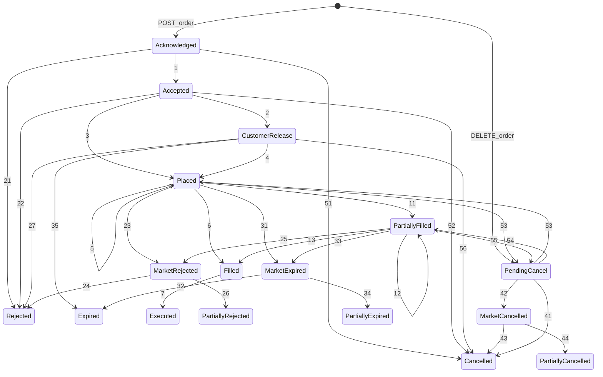

| ID | Start State | Condition | End State |
| --- | --- | --- | --- |
| (P) | - (POST request) | The order has been submitted (POST) to the service provider (an “event”) and is confirmed to be syntactically correct (i.e. correct in form and format). When the request has been acknowledged, the order is created and put into this state. Note that this is an external event and not as such a transition. | Acknowledged |
||| Note that the service provider has not yet accepted the order to be placed at the market as no (pre-)trade checks have been run yet. ||
| 1 | Acknowledged | The order including allocations has been validated as the service provider has run its (pre-)trade checks against rules, restrictions and other constraints. The order may remain in this state for a longer time, for example, if the order is placed after closure of the market, it may stay inside the service provider’s system until the market opens and the order is placed at the market. Note that the order has not yet been sent to the market. | Accepted |
| 2 | Accepted | The order has been placed at the market (or at another counter party). | Placed |
||| The separation of Accepted and Placed (at market) may support the legal requirement to report the actual placement of the order at the market to the customer. ||
| 3 | Accepted | Before the accepted order can be placed the customer may have to confirm the order (2FA, MFA). Until the confirmation to release the order happens the order stays in this state (except it is cancelled or it expires) | Customer Release |
||| Note that if the trading size is exceeded the order may already have been rejected in a previous transition (see Acknowledged → Rejected). ||
| 4 | Customer Release | The ordered has been released through 2FA, MFA by the customer and has been placed at the market (or at another counter party). | Placed |
| 5 | Placed | The placed order is adjusted by service provider, for example, through a manual intervention. | Placed |
| 6 | Placed | The placed order has been completely executed (in one go). | Filled |
| 7 | Filled | The completely filled order has been allocated to the client(s) and is confirmed to be (fully) executed. | Executed |
| 8-10 || not used ||
| 11 | Placed | The newly placed order has executed a partial fill. | Partially Filled |
| 12 | Partially Filled | The state is reiterated in several cases - in general when there are some changes on the order: | Partially Filled |
||| Further partial executions have happened. ||
||| (Partial) fills have been allocated to the client(s) (e.g., compulsory settlement at service provider). ||
||| Note the transition Partially Filled → Filled is mandatory if the order is completed. ||
| 13 | Partially Filled | The partial execution has completely filled the order. | Filled |
||| Note that this transition is mandatory for completely filled orders. ||
| 14-20 || not used ||
| 21 | Acknowledge | The order is rejected due to a violation of any rules or checks that the service provider applies (e.g. pre-tradechecks or permissions). See the cancellation reasons in the response. | Rejected |
||| This is the final state of an order. If the same but modified/corrected order must be submitted again, it is crucial that the service user submits the order with a new client order identification. ||
||| Note that this transition may also be result of exceeding the permissible trading size as per contract. ||
| 22 | Accepted | The order cannot be placed at the market (or counterparty), for example, due to wrong tick size and the market rejects it immediately. | Rejected |
||| This is the final state of an order. If the same but modified/corrected order must be submitted again, it is crucial that the service user submits the order with a new client order identification. ||
| 23 | Placed | The order is rejected by the market maker or counter party after it has been placed and before any executions have happended. See the cancellation reasons in the response. This may happen when an “unusual“ (i.e. prices deviate highly from market) order, which is routed through an intermediate broker, is terminated through a manual intervention of the intermediate broker. | Market Rejected |
| 24 | Market Rejected | The order had no executions (no fills) and is confirmed to be rejected. | Rejected |
| 25 | Partially Filled | The partially filled order is rejected, e.g. due to unusual price action at a market or due a corporate action (like a capital increase) that leads to an automatic “cancellation” of the order. | Market Rejected |
| 26 | Market Rejected | The partially filled order has been allocated to the client(s) and is confirmed to be rejected. | Rejected Partial |
| 27 | Customer Release |The order has been rejected by customer or service provider. | Rejected |
| 28-30 || not used ||
| 31 | Placed | The placed order has expired at the market without any executions. | Market Expired |
| 32 | Market Expired | The order without any executions has expired at the service provider. | Expired |
| 33 | Partially Filled | The partially filled order has expired at the market. | Market Expired |
| 34 | Market Expired | The order with partial fills has expired at the service provider. Any open fills were allocated to the client(s). |Expired Partial |
||| Note that the expired order has partial executions. ||
| 35 | Customer Release | The order was not released by the customer in time or the deadline has been exceeded. | Expired |
| 36-40 || not used ||
| 41 | Pending Cancel | The order that was not yet placed at the market is cancelled successfully. In this case there were no executions. |Cancelled |
| 42 | Pending Cancel | The market confirmed that the order has been cancelled. This may be a legally mandatory state change. | Market Cancelled |
||| Note that this is a partial cancellation for outstanding quantities only. Any previously executed partial fills remain. ||
| 43 | Market Cancelled | The order had no executions (no fills) and is confirmed to be cancelled. | Cancelled |
| 44 | Market Cancelled | The partially filled order has been allocated to the client(s) and is confirmed to be cancelled. | Cancelled Partial |
||| Note that the cancelled order contains partial executions and their corresponding allocations. ||
| 45-50 || not used ||
| (C) | - (POST request) | The cancellation request of the order has been submitted (DELETE) to the service provider (an “event”) and is acknowledged to be syntactically correct (i.e. correct in form and format). When the request has been acknowledged, the order itself is put into this state. Note that this is an external event and not as such a transition. | Pending Cancel or Cancelled |
||| Note that the service provider has not yet confirmed the cancellation of the order itself. ||
| 51 | Acknowledged | The order is cancelled successfully. | Cancelled |
||| Alternative transition Acknowledged → Pending Cancel: Should a direct transition not be possible the order is flagged for cancellation (but not successfully processed nor confirmed yet). ||
| 52 | Accepted | The order is cancelled successfully. | Cancelled |
||| Alternative transition Accepted → Pending Cancel: Should a direct transition not be possible the order is flagged for cancellation (but not successfully processed nor confirmed yet). ||
| 53 | Placed | The order is flagged for cancellation and not successfully processed nor confirmed yet. | Pending Cancel |
||| Note that should the cancellation at the market not be possible the state of the order will return to Placed. ||
|54|Filled|The completely filled order is flagged for cancellation as per request, however, it will return to Filled after the state Pending Cancel. It is assumed that this transition is required to acknowledge that it was attempted to cancel the order. | Pending Cancel |
||| Note that a completely filled order cannot be cancelled. ||
| 55 | Partially Filled | The partially filled market order is flagged for cancellation and not successfully processed nor confirmed yet. |Pending Cancel |
||| Note that should the cancellation for any reason not be possible the state of the order will return to Partially Filled. ||
| 56 | Customer Release | The order awaiting customer release is cancelled successfully. | Pending Cancel |
||| Alternative transition Customer Release → Pending Cancel: Should a direct transition not be possible the order is flagged for cancellation (but not successfully processed nor confirmed yet). ||
||| Note that it will also cancel any confirmation requests via 2FA, MFA. ||
||| /end of transition list/ ||
